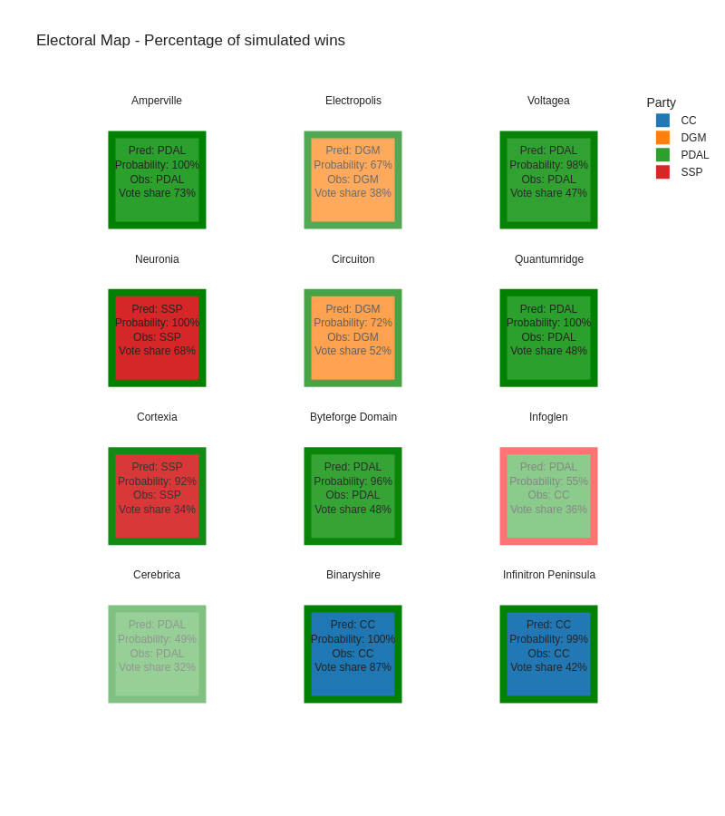
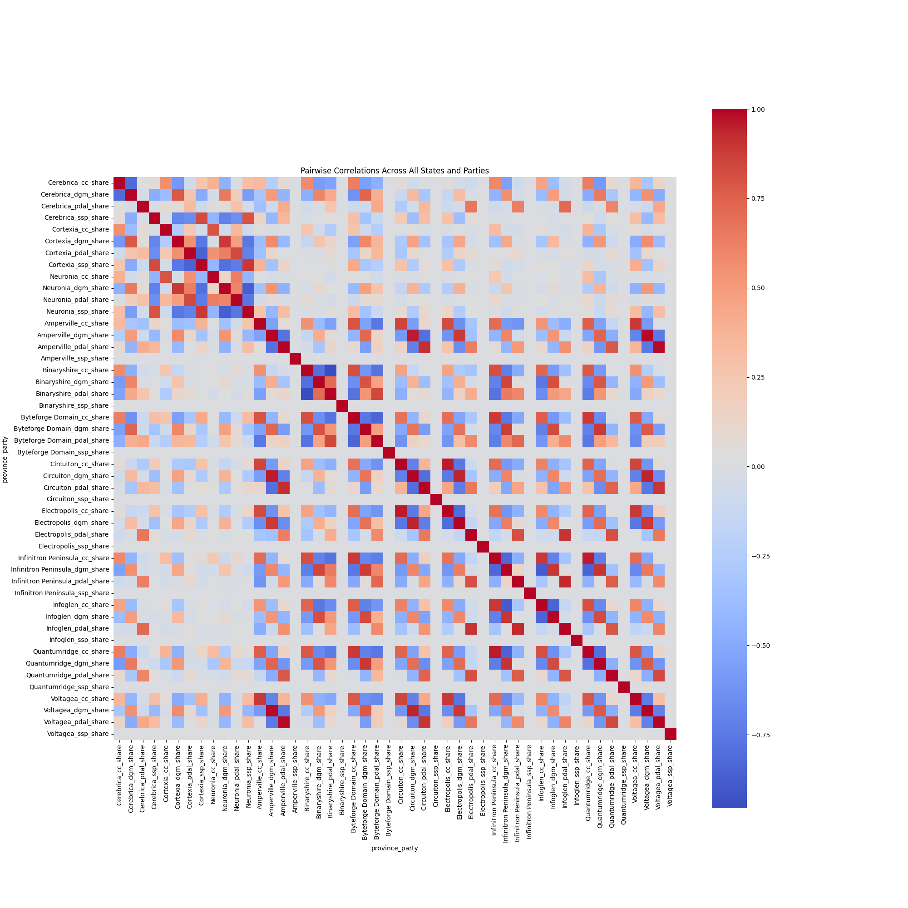

# Election Forecasting Package

## Table of Contents
1. [Introduction](#introduction)
4. [Key Scripts and Modules](#key-scripts-and-modules)
2. [High Level Overview](#highlevel-overview)
2. [Low Level Overview](#lowlevel-overview)
6. [Modelling](#modelling)
7. [Visualization](#visualization)
3. [Directory Structure](#directory-structure)

## Introduction
This package performs a Hierarchical Bayesian analysis using PyMC to forecast state-level and national election results in a fictional country called "Dataland." Dataland comprises 12 provinces and four political parties. Notably, the SSP party only contests three of these provinces. The forecasting approach first implements a adaptation of Alan Abramowitz's 2012 "time for change" fundamentals-based model [[1]](#1), extended to a multi-party electoral system, to estimate the national vote share on election day. This is then combined with national polling data and the historical partisan tendencies of each state. This provides a full set of vote share predictions, state-specific win probabilities, and national level win probabilities for each day of the polling period, typically spanning less than three months within Dataland's one-year electoral cycle.

<a id="1">[1]</a> 
 Abramowitz, A. (2012). *Forecasting in a Polarized Era: The Time for Change Model and the 2012 Presidential Election*. PS: Political Science & Politics, 45(4), 618-619. doi:10.1017/S104909651200087X


## Key Scripts and Modules
- **Data Processing**:
    - `process_partisan_leans.py`: Computes partisan leans for each state based on historical vote share data.
    - `poll_trends.py`: Calculates polling trend lines using a weighted 7-day moving average.
    - `process_fundamentals_data.py`: Processes lagged economic indicators.

- **Modelling**:
    - `DatalandElectionModel.py`: Defines and executes the electoral forecasting model employing a Bayesian workflow.

## High level overview
The workflow encompasses several pre-processing steps outlined below, orchestrated by `main.py`:

1. Calculation of partisan leans for each state.
2. Incorporation and processing of raw polling data.
3. Time series forecasting of poll predictions using a General Additive Model (GAM).
4. Processing of lagged economic indicators.
5. Electoral forecasting leveraging a Bayesian framework via PyMC [[2]](#2).

The outcomes of these steps are synthesized to simulate election results, both at the state and national levels, which are then visualized.

[2]: Abril-Pla, O., Andreani, V., Carroll, C., Dong, L., Fonnesbeck, C.J., Kochurov, M., Kumar, R., Lao, J., Luhmann, C.C., Martin, O.A., Osthege, M., Vieira, R., Wiecki, T., & Zinkov, R. (2023). *PyMC: A Modern and Comprehensive Probabilistic Programming Framework in Python*.


## Low level overview

1. Data Processing
    1. Calculating the partisan leans for each state:
        - To calculate these, I take the deviation of a state's vote share from the national vote share, for each year. I then take the exponentially weighted sum of these partisan leans over all past data ($ \text{w} = \frac{\alpha^i}{\sum_{j=0}^{i} \alpha^j}$), to arrive at a current year's partisan lean matrix.
        - This approach aims to smooth out sudden changes in a state's partisan lean from year to year. This processing is performed [here](./ElectionForecasting/src/data/processing/process_partisan_leans.py).
    2. Incorporating polling data:
        1. Calculating polling trends:
            - This data forms an irregularly spaced time series and contains both national and state-specific polling information. It's worth noting that the data may not always represent all parties, leading to potential inaccuracies. The polling data also comes with several metadata properties that could indicate party-specific biases.
            - To integrate this data, I calculate polling trend lines using a weighted 7-day moving average of the national polling figures. The weighting configuration for the metadata is defined [here](./ElectionForecasting/configuration_files/poll_weightings.json).
            - This poll trend also included a sample size based weighting that was advocated by the polling aggregator, 538 magazine [[3]](#3). This suggests a weighting of: 
            
              $\text{weight} = \sqrt{n / \overline{N}}$

            Where $n$ is the sample size of the given poll and $\overline{N}$ is the number of polls performed by the given pollster on that regional scale. This is designed to prevent any one pollster from dominating the polling averages.
            - The 7-day moving average was performed using a separate analysis package that I developed, called [PollScraper](https://github.com/AEJaspan/PollScraper/), and is called [here](ElectionForecasting/src/data/polls/poll_trends.py).
        2. Time series forecasting of poll trends:
            - I then perform a time series forecasting of each parties poll predictions, as well as the 'undecided' poll predictions.
            - Various approaches were experimented with here, including using a General Additive Model (GAM), via the statsmodels library [[4]](#4). In this stage, I start by capping extreme values in the poll trends. I then build my GAM model using B-spline smoothing for each predictor. I allow for 15 degrees of freedom for each predictor variable, and i set the degree of the  polynomial pieces that make up each B-spline to 3, meaning that there are $N_{knots} = \text{DoF}-\text{degree}-1 = 12$ internal knots for each predictor variable in addition to the boundary knots.
            - Additionally, I implemented an ad-hoc version of a particle filter for forecasting. In the state transition model, each particle was evolved using a weighted average of its previous state and the most recent observation, along with some Gaussian noise $(( x_t = 0.5 \times x_{t-1} + 0.5 \times y_t + \epsilon ))$. For the observation model, particle weights were updated based on the Dirichlet likelihood of the observed vote shares, effectively performing a resampling step to focus the particles around more likely states.
            - Based on a comparison of their respective MAE and RMSE scores, seen below in Table 1. As such, I decided to proceed with the GAM implementation.
    3. Fundamentals data:
        - Finally, I also calculate lagged indicators of Datalands' year on year percentage change in GDP, unemployment rate, inflation and stock market returns, as well as which party was in power, and which party won the popular vote. This is incorporated in a modular way, so that it is simple to experiment with additional quarters of lagged data. The published model only considers the final quarter of data prior to the first polling day. This is performed [here](./ElectionForecasting/src/data/processing/process_fundamentals_data.py)
  2. Forecasting model (implemented [here](./ElectionForecasting/src/modelling/DatalandElectionModel.py))
    1. Fundamentals prediction
      1. In this model, I calculate the Dirichlet-distributed vote share for the four parties, using one quarter of lagged economic indicators as my prior. Dataland experienced a bought of high inflation in the 80s' and 90s', but has since moved into a new inflationary environment, with even a quarter of deflation in 3rd quarter of 1999! This dual modality makes this distribution challenging to model accurately. To address this, I applied the following transformation:
        $\log\left(\sqrt{\left| \text{inflation} \right|}\right)$.
      2. I subsequently model the GDP, stock market, and transformed inflation using normal distributions. For unemployment data, I use a half-normal distribution. Additionally, I model the popular vote and the party in power as categorical random variables, with uniform Dirichlet priors assigned to each party. Table 2, below, outlines the priors that I implement for each of the economic indicators.
      3. I combine all of these elements forms the prior for my Dirichlet distribution, which serves as the basis for my fundamentals-based prediction of the national vote share.
      4. I then apply a Boolean mask to the combined national vote share projections, setting each party's national prediction as its starting value in each state. This Boolean mask identifies which parties are competing in which states. Additionally, I adjust the fundamentals prediction based on the number of states in which each party is competing. This is particularly important for the SSP, which is underrepresented in the only three states in which it competes, when considering just national polling data alone.

  2. Combined model
       1. I then combine all available polling data with the national vote share using a linear function. This function has inflection points that users can set at their discretion. Initially, following a Bayesian approach, I set these inflection points as uniform distributions centered around 0.25 and 0.75. Based on the outcomes, I later hard-coded these values to 0.85 and 0.35 in successive runs to improve performance efficiency. This linear function is defined as following:
          - The general formula to rescale a function $( f(x) )$ that is originally bounded between $( [A, B] )$ to new bounds $( [C, D] )$ is: 
          
          $g(x) = C + \frac{(D - C) \times (f(x) - A)}{B - A}$
          - Therefore, I take a linear function, bounded between 0 and 1, and rescale it as:
          
          $$norm_{t} = \text{min}(\text{switchpoint}) + \Delta\text{switchpoint} \times \left( \frac{t}{n_{\text{time points}}} \right)$$

  3. Partisan lean adjustments
      - The state-specific vote shares are then calculated as the sum of the previous year's partisan leans and the current national vote share projections. During model development, I attempted to incorporate the pairwise correlations of each party's partisan leanings across all states. However, including this correlation matrix led to significant model instability and negatively impacted the results. Consequently, this element was omitted from the model.
  4. Win probabilities
      - This workflow results in an estimate for each parties vote share in each state. Each simulated election is then parsed through the Electoral College as defined [here](ElectionForecasting/data/dataland/dataland_electoral_calendar.csv) to determine the winner of the presidency in each simulated election.
      - The percentage of elections in which each party wins the Electoral College is then taken as the probability of that party winning overall.
      - Similarly, the percentage of simulations where each party wins in a specific state is taken as the probability of that party winning in that state. These probabilities can be visualized here [Simulation Results Map](#simulationresultsmap)

[3]: Silver, N. (2021, March 25). *The Death Of Polling Is Greatly Exaggerated*. FiveThirtyEight.

[4]: Seabold, S., & Perktold, J. (2010). *Statsmodels: Econometric and Statistical Modeling with Python*. In *9th Python in Science Conference*.


| Model              | MAE    | RMSE  |
|------------------- |--------|-------|
| GAM                | 0.0053 |0.0068 |
| PyMCGAM            | 0.0038 |0.0050 |
| Particle Filter    | 0.0151 |0.0180 |
> Table 1 - these values are the average across each party, over 40 years of poll forecasts.

| Variable             | $\mu$  | $\sigma$  | Distribution      |
|----------------------|--------|-----------|-------------------|
| betas_gdp            | 0.027  | 0.020     |$$\mathcal{N(\mu, \sigma)}$$    |
| betas_stk_mkt        | 0.094  | 0.100     |$$\mathcal{N(\mu, \sigma)}$$    |
| betas_unemployment   |        | 0.019     |$$\mathcal{HN(\sigma)}\  $$    |
| betas_inflation      | -1.798 | 0.522     |$$\mathcal{N(\mu, \sigma)}$$    |
> Table 2


- **TimeSeries Overlay**:
    
    > These plots show the overlay of the prior estimates across all point observations of these processes.

 
- **Data Distribution**:
  
  > It is shown that the prior estimates are reasonably good choices for the GDP percent change and the Unemployment rate, where as an alternative distribution, such as a skewed-normal or bi-modal distribution may be more suitable for the inflation or stock market data. More attention is definitely needed here.

## Modelling
The core of the electoral forecasting model is housed in `DatalandElectionModel.py`. This script encapsulates a Bayesian workflow via PyMC, utilizing a Dirichlet distribution to compute the vote share of the four parties. The model intricately combines lagged economic indicators, polling data, and historical partisan leans to generate vote share predictions at both the national and state levels. The script further elaborates on the mathematical formulations and Bayesian approach employed to reconcile polling data with the "time for change" fundamentals-based predictions.

## Visualization

Below are some visualisations of the models' performance against a holdout data set. To produce these plots, a model was fitted on all data from 1984 - 2022. At inference, the partisan leans from the year 2022, along with the preceding economic and polling data was used to update the model, providing a live prediction of the result in 2023. The data from this year is then shown against my predictions for comparison.

<details>
  <summary>
      <h2><strong>Note.</strong></h2>
</summary>

#### Note - several of these plots are interactive, which is unfortunately unsuported by GitHub 🙁 - for the full plots, please check [here](ElectionForecasting/plots/static_plots/). The `.html` files can be rendered separately in your web browser!  
</details>


- **Simulation Results Map**:
  
  > This plot gives a pretty intuitive overview of the models' predictions for each state. Each state shows the predicted winner (with the confidence in that prediction), against the actual winner. The probability is also shown in the opacity of the colour used. States in which the prediction is correct, are bordered in green 🎉, and states in which the model gets it wrong are bordered in red 😞. You can see here that the model correctly predicts 10/12 state election results. A interactive version of this plot can be downloaded and viewed in your web browser [here](ElectionForecasting/plots/static_plots/2023/plots/simulation_results_map.html).


- **Violin National**:
  
  > This violin plot provides a clear way of visualising the uncertainty in my vote share estimates. Similar plots are available on a state-by-state basis for 2023 in the [plots](ElectionForecasting/plots/static_plots/) directory.


- **National Vote Share Predictions with Win Probabilities**:
  
  > This incredibly cluttered plot shows each individual polling data point for each party that is contesting the election, on every day of polling. It also includes a simple average of these polls, as well as the predicted vote share, and as if that was not enough, i've also thrown in the observed national election results too, for good measure. A interactive version of this plot can be downloaded and viewed in your web browser [here](ElectionForecasting/plots/static_plots/2023/plots/National_predictions_with_win_probs.html).


- **Correlation Matrix**:
  
  > This plot shows the pair wise correlation matrix, for every parties performance in each state, against every other party and state combination. This has the structure that might be expected - with the SSP having strong inter party and inter-province correlations within the Synapse Territories, but being weakly correlated with party performance from outside the region. Unfortunately, this correlation structure did not manage to make it into the model, but it gives a good idea of interstate dynamics across Dataland. A interactive version of this plot can be downloaded and viewed in your web browser [here](ElectionForecasting/plots/static_plots/correlation_matrix.html).


# HOW TO RUN:

<details>
  <summary>
      <h2><strong>Note.</strong></h2>
</summary>

To run the different scenarios, you must first join each scenario's polling data with the historic polling data. There is a helper script written for this purpose in the `data/` directory [here](ElectionForecasting/data/combine_scenarios_data.py).

</details>

## Build environment

```
python3 -m venv .venv
source .venv/bin/activate
pip install -r requirements.txt
```

The main steering script is located at

```
ElectionForecasting/src/main.py
```

This can be called directly or through the command-line as `ElectionForecasting`.

## Processing historical inputs
```
ElectionForecasting --process_historical
```

## Processing scenario inputs
```
SCENARIOS=$(echo {A..E} | tr ' ' ',')
ElectionForecasting --process_scenarios --scenario_list $SCENARIOS
```

## Running on the different scenarios
```
SCENARIOS=$(echo {A..E} | tr ' ' ',')
ElectionForecasting --run_on_holdout --scenario_list $SCENARIOS
```

## Back testing
```
ElectionForecasting --run_backtesting --years_min 2018 --years_max 2024
```

## Run it all
```
SCENARIOS=$(echo {A..E} | tr ' ' ',')
ElectionForecasting --run_backtesting --years_min 2018 --years_max 2024 --run_on_holdout --scenario_list $SCENARIOS --process_scenarios --process_historical
```

# TODO:

* Experimenting with time-for-change priors.
* Complete study into Random Forest derived poll weighting (ongoing work can be found [here](notebooks/calculate_poll_weights.py)).
* Additional work on time series forecasting (ongoing work can be found [here](notebooks/time_series_forcasting.ipynb)).
* Integrate correlation analysis into the model.
* Integrate demographic correlations into the model.
* Integrate regional polls.
* Hyper parameter optimisation and further model experimentation.
* Confusion matrix of state results.
* Clean up model presentation and plot content.
* General code cleanup and implementation of best practices.
<!-- merge inference process into one object -->

## Directory Structure

```
ElectionForecasting/
│
├── data/
│ └── (Scripts related to combining scenario data)
│
├── src/
│ ├── __init__.py
│ ├── config.py
│ ├── root.py
│ ├── main.py (Main script to run any part of the workflow.)
│ │
│ ├── data/
│ │ └── (Scripts for data ingestion and transformation)
│ │
│ ├── modelling/
│ │ └── (Scripts for modelling and driving the analysis)
│ │
│ ├── utils/
│ │ └── (Utility functions)
│ │
│ ├── validation/
│ │ └── (Scripts for model validation and inference)
│ │
│ └── visualisations/
│ └── (Scripts for generating visualizations and plots)
```
